
 <h1> Project 1. Анализ резюме из HeadHunter </h1>

  

# Содержание

[1. Введение](#1-введение)

[2. Описание задачи](#2-описание-задачи)

[3. Описание данных](#3-описание-данных)

[4. Выводы](#4-выводы)

## 1. Введение
Компания HeadHunter хочет построить модель, которая бы автоматически определяла примерный уровень заработной платы, подходящей пользователю, исходя из информации, которую он указал о себе. Однако прежде чем построить модель, данные необходимо преобразовать, исследовать и очистить. В этом и заключается цель данного проекта!

## 2. Описание задачи
Проект состоит из четырёх частей: 

[1. Базовый анализ структуры данных](#1-базовый-анализ-структуры-данных)

[2. Преобразование данных](#2-преобразование-данных)

[3. Разведывательный анализ](#3-разведывательный-анализ) 

[4. Очистка данных](#4-очистка-данных)

Каждая часть состоит из блока практических заданий, которые необходимо было выполнить в jupyter-ноутбуке.

## 3. Описание данных

В проекте используется [база резюме](https://drive.usercontent.google.com/download?id=1Kb78mAWYKcYlellTGhIjPI-bCcKbGuTn&export=download&authuser=0&confirm=t&uuid=b9fbbb8a-aefc-4616-9b2b-115cc98c3ed8&at=APZUnTUH19gN9FKGgbxRAj7S3Wkx%3A1712526166719), выгруженная с сайта поиска вакансий hh.ru.

Датасет содержит 44744 обезличенные записи по 12 признакам:

- Пол, возраст - пол и возраст соискателя;

- ЗП - ожидаемая заработная плата;

- Ищет работу на должность: - сведенья о желаемой должности;

- Город, переезд, командировки - город проживания соискателя, его готовность к переезду и командировкам;

- Занятость - желаемая занятость в виде одной из категорий: полная занятость, частичная занятость, проектная работа, волонтерство, стажировка;

- График - желаемый график работы в виде одной из категорий: полный день, сменный график, гибкий график, удаленная работа, вахтовый метод;

- Опыт работы - сведенья об опыте работы соискателя;

- Последнее/нынешнее место работы - сведенья последнем/нынешнем месте работы;

- Последняя/нынешняя должность - сведенья о последней/нынешней должности;

- Образование и ВУЗ - уровень образования соискателя и наименование законченного учебного заведения;

- Обновление резюме - дата и время последнего обновления резюме соискателем;

- Авто - наличие у соискателя автомобиля.

Файл ExchangeRates.csv содержит сведенья о курсах валют, в частности интересующие признаки:

* "currency" - наименование валюты в ISO кодировке,

* "date" - дата, 

* "proportion" - пропорция, 

* "close" - цена закрытия (последний зафиксированный курс валюты на указанный день).

## 4. Выводы

### 1. Базовый анализ структуры данных

- основная информация о числе непустых значений и типах данных

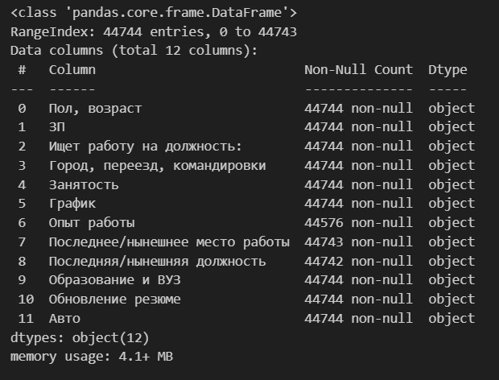

- основная статистическая информация о столбцах

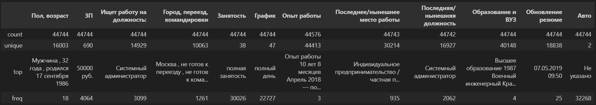

### 2. Преобразование данных

- создание признака "Образование"

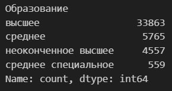

- создание признаков "Пол" и "Возраст" ([*распределение возраста](#возраст) будет графически представлено позднее)

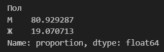

- создание признака "Опыт работы" ([*распределение опыта работы](#опыт-работы) будет графически представлено позднее)

- создание признаков "Город", "Готовность к переезду", "Готовность к командировкам"

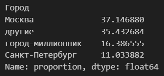

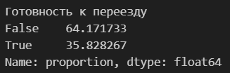

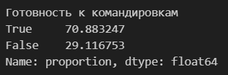

- создание дамми-признаков на основе признаков "Занятость" и "График" One Hot Encoding по следующей схеме:

- создание признака 'ЗП (руб)' ([*распределение ЗП](#ЗП) будет графически представлено позднее)

- основная информация о числе непустых значений и типах данных после преобразований

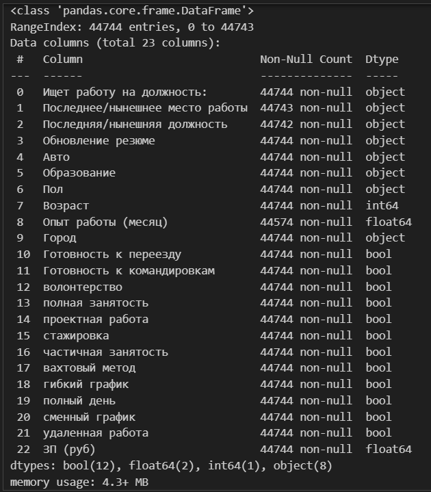

### 3. Разведывательный анализ

#### Возраст

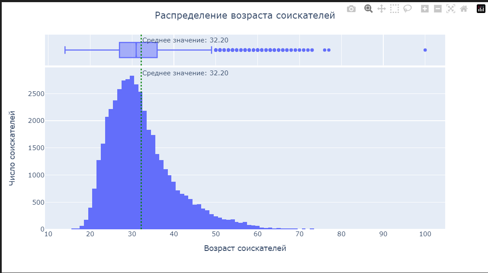

**Выводы**

1. Модальное значение возраста соискателей составляет 30 лет.

2. Предельные значения в диапазоне от 14 до 100 лет

3. Возраст большинства соискателей находится в интервале от 27 до 36 лет

4. К аномалиям можно отнести возраст соискателя в 100 лет. Наличие большого числа потенциальных выбросов справа (50+ лет ) скорее говорит о малом числе соискателей почтенного возраста, чем об аномальности таких значений.

##### Опыт работы

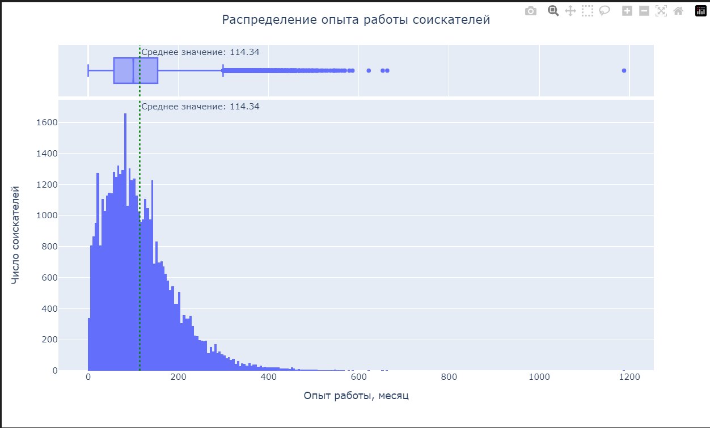

**Выводы:**
1. Модальное значение опыта работы соискателей в среднем составляет 82 месяца (так как модой выступают 5 значений: 80, 81, 82, 83, 84)

2. Предельные значения в диапазоне от 0 до 1188 месяцев

3. Опыт работы большинства соискателей находится в интервале от 57 до 154 месяцев

4. К аномалии можно отнести опыт работы в 1188 месяцев (99 лет). Наличие большого числа потенциальных выбросов справа с опытом работы порядка 600 месяцев подтверждает наличие малого числа соискателей почтенного возраста, показанного на предыдущем графике.

#### ЗП 

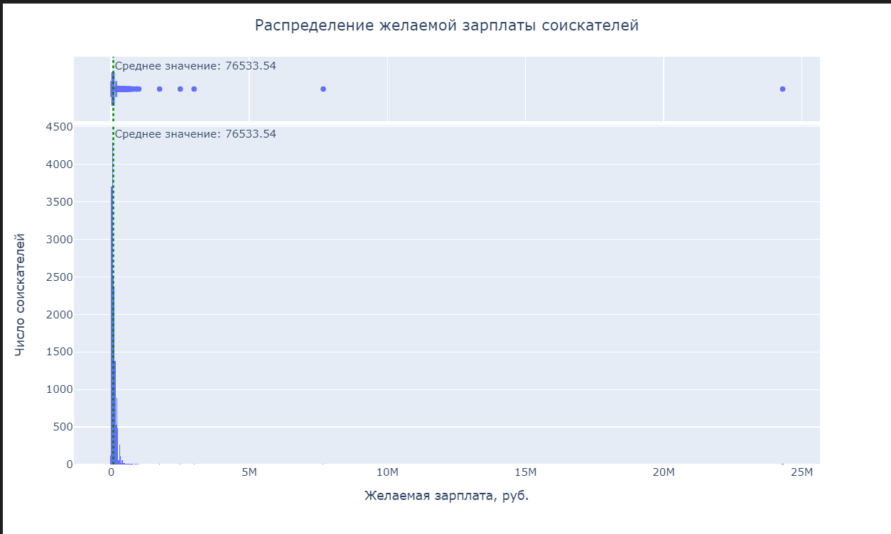

**Выводы:**

1. Модальное значение желаемой зарплаты соискателей составляет 50000 рублей.

2. Предельные значения в диапазоне от 1 до 24 млн. рублей (такой интервал потому что пропущенные значения заменились на 1)

3. Желаемая зарплата  большинства соискателей находится в интервале от 37000 до 95000 рублей.

4. К аномалиям можно отнести значения близкие к 0. Нечитаемость графиков (на гистограмме практически ничего не видно, а диаграмма размаха имеет сплюснутый вид) свидетельствует о наличии значений сильно отличающихся от основной массы.

#### ЗП от Образования

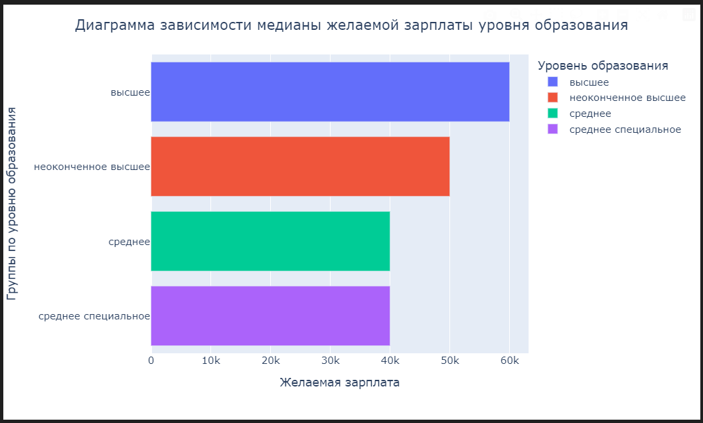

**Выводы:**

1. Для соискателей с высшим уровнем образования наблюдаются наибольшие уровни желаемой заработной платы. Для соискателей со средним и средним специальным уровнями образования наблюдаются наименьшие уровни желаемой заработной платы.

2. Из графика можно сделать вывод, что уровень образования имеет значительное влияние на ожидаемую заработную плату соискателя. С увеличением уровня образования увеличивается и медианное значение ожидаемой зарплаты. Это свидетельствует о важности уровня образования как фактора при прогнозировании ожидаемой заработной платы.

#### ЗП от Города

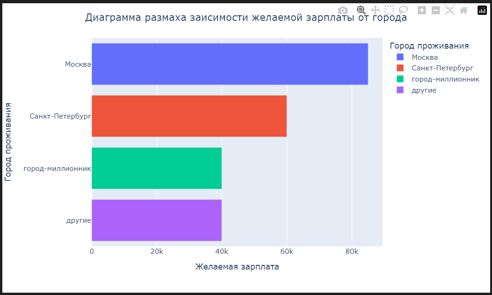

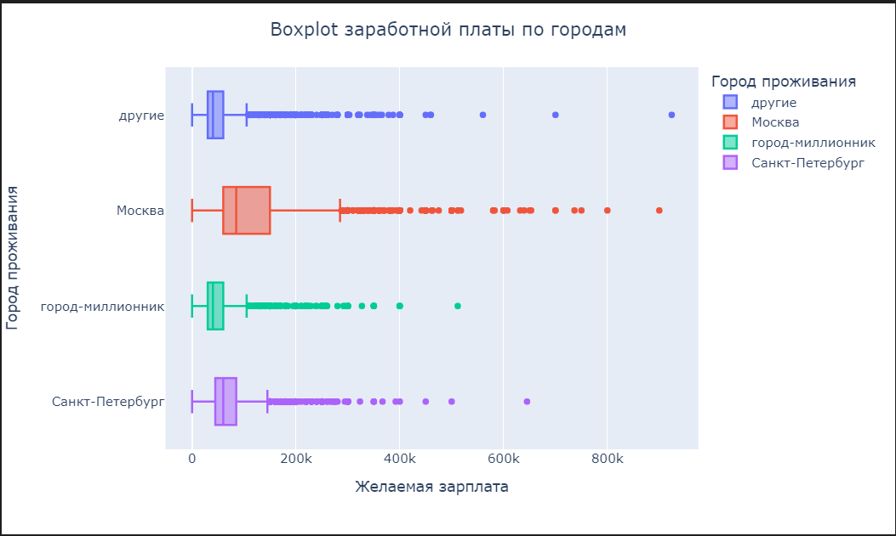

**Выводы:**

1. Для Москвы медианная желаемая зарплата составляет 85 тысяч рублей, с размахом от 1 до 285 тысяч рублей. 

2. В Санкт-Петербурге значение желаемой зарплаты ниже, чем в Москве, составляя 60 тысяч рублей, с размахом от 1 до 145 тысяч рублей. 

3. В городах-миллионниках и других городах медианная желаемая зарплата равна 40 тысячам рублей, с размахом от 1 до 105 тысяч рублей. 

4. Нижняя граница размаха во всех категориях равна 1 рублю, что указывает на частые опечатки при заполнении анкет. Медиана и размах желаемой зарплаты зависят от городского признака и уменьшаются с уменьшением населения города. Совпадение значений в городах-миллионниках и других городах, скорее всего, связано с количеством соискателей (соискателей из других городов должно быть значительно больше), а также с тем, что аппетиты соискателей из городов-миллионников не достигают уровня столичных городов, хотя встречаются выбросы. Признак города играет важную роль при прогнозировании заработной платы.

#### ЗП от готовности к переезду и командировкам

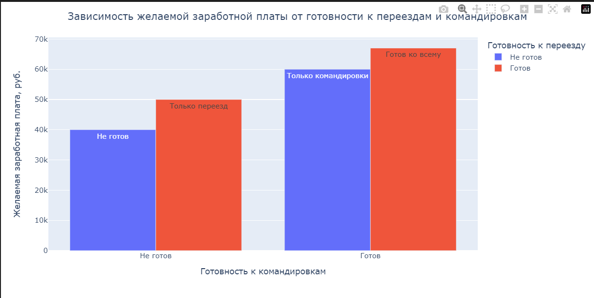

**Выводы:**

1. Чем выше готовность к командировкам и переезду, тем выше медиана ожидаемой зарплаты. Последовательно по убыванию значений следуют категории соискателей, готовых только к командировкам, готовых только к переезду, и не готовых к командировкам и переездам. 

2. Уровень ожидаемой зарплаты возрастает с увеличением мобильности. 

3. Важно отметить, что готовность к командировкам ценится выше, чем готовность к переезду, скорее всего из-за большей профессиональной ответственности и самостоятельности, требуемых при командировках.

#### Возраст и Образование

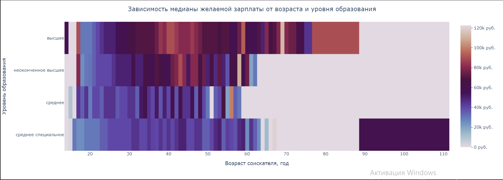

**Выводы:**

1. Для соискателей с высшим образованием наблюдается наибольший рост медианы ожидаемой зарплаты, который продолжается до 41 года, а затем плавно снижается. Однако после 58 лет наблюдается значительная неравномерность в значениях медианной ожидаемой зарплаты, вероятно, из-за различий в квалификации и предпочтениях соискателей. Высшее образование распространено практически во всех возрастных группах и является наиболее распространенным. Некоторые соискатели с высшим образованием и молодым возрастом могут иметь завышенные ожидания по зарплате, что может быть ошибкой при заполнении анкеты.

2. Для уровня образования "неоконченное высшее" наблюдается рост медианы ожидаемой зарплаты до 43 лет, после чего неравномерность значений усиливается из-за уменьшения числа соискателей с таким образованием по мере старения. Аномальные значения для 17 лет также могут быть вызваны ошибками или завышенными требованиями соискателей.

3. Для среднего образования характерен умеренный рост неравномерности медианы ожидаемой зарплаты с возрастом. Встречаются соискатели младше 17 лет, возможно, только что окончившие школу. Выбросы для 54 и 56 лет могут быть связаны с уникальными навыками или опытом работы. Группа со средним образованием имеет предельный возраст в 58 лет, что может объясняться отсутствием интернет-активности у старших поколений.

4. Для среднего специального образования также характерен плавный рост медианы ожидаемой зарплаты и увеличение неравномерности с возрастом. Аномальные значения для 67 и 100 лет могут быть вызваны высокой самооценкой соискателей или ошибками в данных, так как значение для 100 лет является вероятно ошибочным.

#### Опыт работы от Возраста

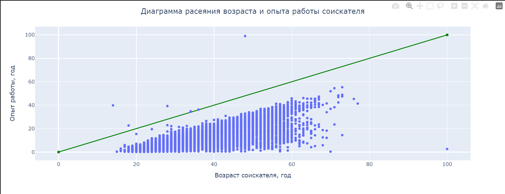

**Выводы:**

На диаграмме видно 7 аномальных значений точки выше линии обозначающий равенство опыта работы и возраста - соискатели указали опыт работы превышающий их возраст. К аномальному также можно отнести единственного соскателя возрастом 100 лет и маленьким опытом работы. Также присутствуют большое количество соискателей во всех возрастных группах (особенно до 58 лет) с малым опытом работы. Возможно причина в отсутствии оффициального трудоустройства на предыдущих местах работы, или соискатели решившие кардинально сменить род деятельности и поэтому не считающие важным предыдущий опыт работы.

#### Дополнительные графики

**ЗП от Возраста и Пола**

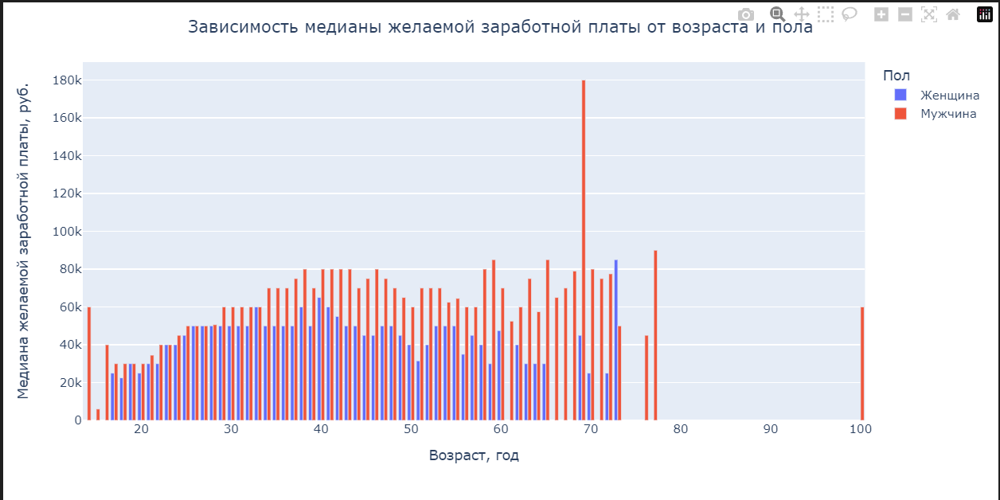

**Выводы:**

1. На диаграмме видно, что до с 22 до 29 лет уровень медианы ожидаемой зарплаты идентичен, далее наблюдается рост показателя для соискателей мужского пола. 

2. Меньший показатель желаемой заработной платы среди соискателей женского пола возможно связан с поиском работы после декретного отпуска. Однако имеется и аномальное значение для 73 лет, скорее всего это связано с количеством соискателей разного пола и уровня их образования. 

3. Важно отметить аномальные значения для 69 и 100 лет среди соискателей мужского пола, которые могут быть связаны с небольшим количеством соискателей в этих возрастных категориях или с особенностями их образования или с ошибкой заполнения анкеты.

4. В целом можно сказать, что соискатели мужчины после 29 лет ожидают больший уровень зарплаты.

**ЗП от Пола и Образования**

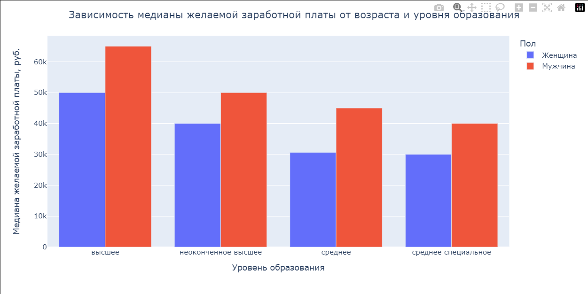

**Выводы:**

1. С увеличением уровня образования растет ожидаемая заработная плата.

2. Женщины соискатели на всех уровнях образования имеют более низкий уровень заработной платы, что, вероятно, связано с периодом поиска работы после декретного отпуска.

3. Приблизительно одинаковый уровень заработной платы у женщин-соискателей среднего и среднего специального образования, вероятно, объясняется их предпочтением повышения уровня образования или временного ухода в декретный отпуск.

### 4. Очистка данных

- дубликаты

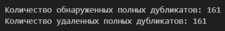

- пропуски

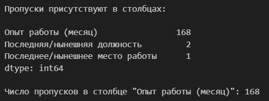

- выбросы

- удаляем ошибочные данные и считаем выбросы снова

- Строим распределение в лог масштабе

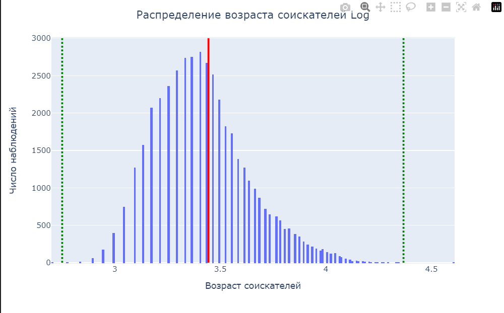

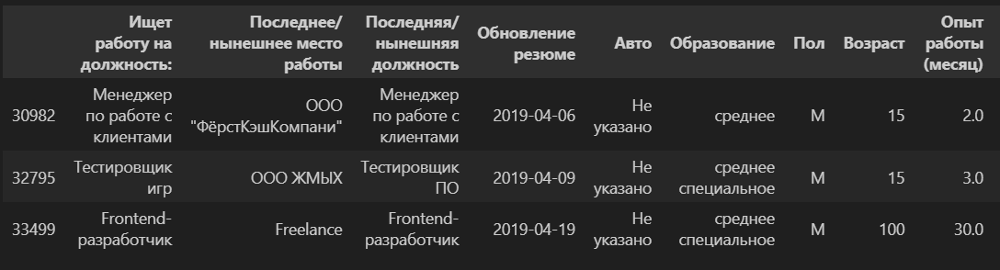

**Выводы:**

1. В логарифмическом масштабе графика наблюдается распределение, похожее на нормальное, с правой асимметрией. 

2. Границы по методу z-отклонений показывают потенциальные выбросы за пределами ±4 сигм обнаружен один потенциальный выброс. 

3. В таблице выбросов обнаружены три значения: два соискателя в возрасте 15 лет и один в возрасте 100 лет. Вероятно, значение 100 лет является опечаткой, а соискатели 15 лет могут быть реальными, учитывая характер работы и ожидаемую зарплату. Уровень образования и опыт работы указывают на возможность ошибок при заполнении анкеты.
